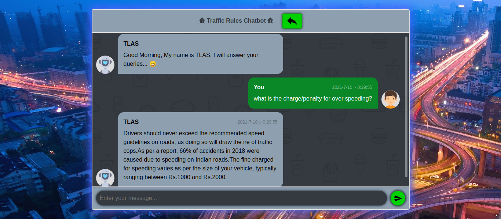

# TLAS-CHAT-BOT
Traffic Law and Awarness System(TLAS) is an AI chatbot that help people to know about traffic rules and make aware about traffic rules and fines in kerala.

Technology used : Django (Python Framework), SQLite, HTML5, Materialize CSS. 

## ScreenShots

#### 1.Entry Page :

#### 2.Chatbot Page(Light theme) :

#### 3.Chatbot Page(Dark theme) :

